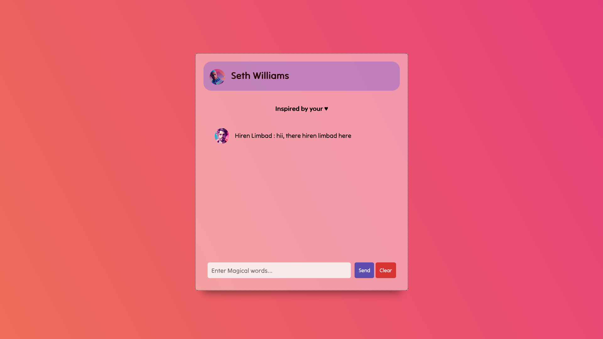

# Chat-App

This is a simple chat application built using Node.js and Socket.IO. The app allows multiple users to chat with each other on the same server. The UI is designed to be user-friendly and visually appealing. Additionally, users can change their usernames as desired.

## Installation

To use the Chat App, follow these steps:

    1) Clone this repository to your local machine using https://github.com/hirenlimbad/chat-app
    2) Navigate to the project directory and run npm install to install the necessary dependencies.
    3) Run npm start to start the server.
    4) start index.html to use the application.
    for above you also can use yarn.
    
## Usage

Once the application is up and running, users can start chatting with each other immediately. Users can change their username by clicking on the "Change Username" button and entering a new name.

The UI is designed to be intuitive and easy to use. Users can send messages by typing in the message input field and pressing the "Send" button or hitting the Enter key.

## Contributing

If you would like to contribute to the development of the Chat App, please feel free to submit a pull request. Bug reports and feature requests can be submitted via the Issues tab on GitHub.
